		CALIFORNIA STATE UNIVERSITY, NORTHRIDGE


# A GEOGRAPHIC MAP SYSTEM:

A graduate project submitted in partial fulfillment of the requirements
for the degree of Master of Science, Computer Science

by

Timothy MacAndrew


May 2000


The graduate project of Timothy MacAndrew is approved:
```
_______________________________ ___________

Michael Barnes Ph.D Date

_______________________________ ___________

C. T. Lin Ph.D. Date

______________________________ ____________

David Salomon Ph.D. - Chair Date
```


		California State University, Northridge

ii

ABSTRACT

# A GEOGRAPHIC MAP SYSTEM

by

Timothy MacAndrew
Master of Science, Computer Science

This document describes the development of a software product that displays
geographic maps of the world. This software product is call A Geographic Map
System (GMS). Primitive map data is obtained from the U.S. Geological Survey
(USGS) and used to generate maps using computer graphics. Map data called
Vector Product Format (VPF) from a database called the Digital Chart of the
World is used to generate wire-framed maps of countries, continents, bodies
of water, etc. These map formats are available as CD-ROMs from the USGS.

The GMS product is divided into two (layered) components (i.e. software
toolkits). The first toolkit is used to read/access the primitive map data from
the databases. The second toolkit is used to manipulate the data so it can be
presented graphically. Graphics operations (that are independent of any
particular graphics platform) are made available via this second toolkit.

The focus of this study is to investigate the "how" of implementing a mapping
application. Several mapping systems are currently commercially available.
However, the details of the implementation are always hidden from the
user/customer. Therefore, this is an investigation of existing technology,
rather than a development of new technology.

# Chapter 1 - Digital Geography

## 1.1 Introduction:

Maps and models of the earth have been produced since antiquity. They
describe the geography of the land, the political boundaries of
countries, and are used for navigation. History shows that
maps and models of the earth were important for trade,
exploration, and military uses. One of the earliest models
of the earth was developed in the 8th century BC by
the Greek philosopher Homer who described the earth as a flat
disk. Anaximenes, in the 6th century BC, then
modeled the earth as a rectangle. But Pythogoras (also
in the 6th century BC) described the earth as a
sphere since he believed that all perfect objects must be based
on a sphere. Plato, Aristotle, and Archimedes all
supported the idea of modeling the earth as a sphere.
Plato calculated the circumference of the earth to be 40,
00 miles while Archimedes' calculations resulted in a circumference of
30,000 miles. Then, in the 3rd century BC, the Greek mathematician
Eratosthenes used physical measurements near Alexandria Egypt and calculated
the circumference of the earth to be 25 000 miles. This is remarkable since
the accepted average circumference of the earth today is 24,901 miles [12].

The Greek mathematician Ptolemy (127-151 AD) developed maps that had
influence through the middle ages and up to the beginning of
the Renaissance. But he erroneously calculated the circumference of the
earth to be 18K miles. Some historians speculate that Columbus
used maps derived from Ptolemy and that led him (Columbus
 to erroneously believe that Asia was only 3,000 or
4,000 miles west of Europe. The Flemish cartographer Gerardus
Mercator (1512-1594) began developing more accurate maps
based on the information gathered by the 15th and 16th century
explorers [12].

By the 17th century AD, it was internationally accepted that
the earth was a flattened sphere (i.e. an ellipsoid). This agreement
was reached after a long debate between French and English geodesists.
The French (Cassini, et.al.) believed the semi-major axis of the
ellipsoid ran from the North-pole to the South-pole. However, the English
(Newton, Huygen, et.al.) believed that the semi-major axis was perpendicular
to the North/South-pole line and were proved correct by a series of
geodetic experiments [12].

Accurate maps and models of the earth are perhaps more important
today than in the past. Maps are important for accurate
navigation (both naval and air), civil engineering, military
planning, and oil and mineral explorations. Other uses include
agriculture, cadastre (i.e. property taxation),
environment and urban planning, surveillance, forestry, and geology
[16].

With the advent of the computer, the earth can be
modeled graphically. Maps can now be quickly rendered and manipulated
to provide users with needed information. Geographic data and the
computer programs that display maps graphically are called Geographic Information Systems (GIS). Also, GIS programs must perform analytic functions
(such as line-of-sight calculations) for an operator.

This project/thesis is a study of the technology used
to process a digital database of geographic data and also to
graphically display that data. A software product, called the Geographic
Map System has been developed in support of this study.

## 1.2 Types of Digital Maps:

At a high level, digital map databases can be divided into three categories:

    Vector Map Systems
    Digitized Raster Systems
    Terrain Elevation Systems 

Vector Map Systems are databases in which the geographic information is
stored as tuples of [latitude, longitude, altitude].
Map images are generated by manipulating these position tuples. For
example, borders of countries and continents are defined as an
array of [latitude, longitude] pairs. Such information
can be used to generate wire-framed maps.

Digitized Raster Systems, the second category, are essentially a
digitization of "paper maps". These databases consist of raster
images of the paper maps. The paper maps are usually
classified by the resolution which in turn determines their use.
Maps of lower resolution are likely to be used by pilots
at high altitudes and maps of higher resolution are used for
low-level flying. A digital database of the maps
is created by scanning the paper maps. A computer system
can then generate raster images from the digitized data. Not
many manipulations of the digital map data are possible since it
is a raster image. Sometimes, vector data is overlaid
on an image of a paper map to augment the image
 This is similar to using acetate overlays on a desktop map
 Also, satellite imagery is considered a Digitized Raster System.
These systems are databases of digital images generated by satellites.
One such system used by the US Department of Defense is
called Arc Digitized Raster Imagery.

Terrain Elevation Systems (the third category) are used to
generate detailed three-dimensional displays of regions of the earth
 Such systems show differences in elevation of the terrain (in
some cases to a high degree of accuracy) and can
be used to generate accurate images of mountains, valleys,
etc. One example of such a system is called Digital
Terrain Elevation Data (DTED) and is produced by the
US Goverment. Each datum in a DTED database represents the
elevation at a particular point on the earth. There are
three types of DTED databases each differing in the resolution of
the data. Level 0 DTED is the lowest resolution at
1000 meters (horizontally) between each datum. Level 1
DTED is more accurate at 100 meters between each datum.
The highest resolution of DTED is Level 2 at 30 meters
between each datum. Level 0 is the only publicly available
database. The other two (Level 1 and Level 2) remain classified by
the US Government.

Note that Terrain Elevation Systems are distinguished from Vector Systems
because the data is eventually used to generate only raster images. For
example, even though DTED data is a series of tuples of
[longitude, latitude, altitude], a GIS program cannot generate the
political boundaries of a country. Furthermore, Terrain Elevation Systems
are distinguished from Digitized Raster Systems because the source data
is not a series of pure pixel values. A GIS program must read the tuples
of [longitude, latitude, altitude] and apply its own coloring scheme to
render an image. Also, three-dimensional transformations can be applied
to the terrain elevation data to generate different projections and
images (of the same data). This is opposed to Digitized Raster Systems
that contain only pixel information. Applying transformations without a frame
of reference will generate an undefined image.

It should be noted that the format of digital map systems can
 vary significantly. This can occur becuase the developer/vendor of
 a GIS product also defined the format of the data. This
 was typically done independently from other map developers and users. This
 usually rendered the data useless to anyone except the vendor ... and
 to whomever purchased the GIS product. However, in more recent
 years, an effort has been made to develop digital map data
 that is independent of any specific GIS product. Such a database
 is said to be of neutral format. GIS products are then
 developed to use these databases of neutral format [17].

Map projection schemes also are important in classifying map systems. A
 projection scheme is used to solve the age old paradox of how
 to display the spherical/ellipsoid earth onto a flat piece of
 paper. Some typical projection schemes are:

## The Mercator Projection:
This scheme places the globe in a cylinder. The equator of
 the globe is tangent with the walls of the cylinder. Thus, the radius
of the cylinder is said to be the same as that of
 the globe. Every point on the globe is then projected onto
 the walls of the cylinder. This is analagous to placing a
 light bulb in the middle of the globe and then observing the
 shadow/image that is projected onto the walls of the cylinder. However,
 accuracy is lost at the poles. Actually, accuracy of the
 image is progressively worse as the projection moves away from the equator
 (north and south). Accuracy is often said to be tolerable
 (for many applications) up to 70° North Latitude and down
 to 70° South Latitude [3].

## Lambert Conformal:
This scheme places a cone on the globe. The image of
 the globe is then projected onto the walls of the cone.
 This scheme gives a more accurate projection at the poles than the
 Mercator Projection. Accuracy is greatest where the edge of the cone
 is tangent to the globe. Actually, different images can be
 generated by orienting the cone at different points on the globe.
 For example, the edges of the cone could be set to
 be tangent with the North/South poles as opposed to the equator [3].

## Transverse Mercator:
This scheme is a variation on the Mercator Projection. It simply
 rotates the globe inside the cylinder such that the North/South
 poles are now tangent to the walls of the cylinder. This
 gives an accurate projection for the points at the poles while sacrificing
 accuracy at the equator [3]. 

Some database systems were produced using more than one projection scheme [10].

Another important characteristic used to categorize map systems is
called the scale of the map. It is also sometimes referred
 to as the resolution of the map data. The scale of
 a map is usually stated as the ratio 1:X where
 the 1 refers to one unit of measure "on the map" and the X refers
 to the same unit of measure but "in the real world". For example,
a scale of 1:10,000 means that 1 centimeter on
 the map corresponds to 10,000 centimeters (0.1 Km) on the earth. Another
method used to specify resolution is the ratio meters-per-pixel. This
ratio is applied to raster images and photographs. The ratio indicates
 how many square meters of an object/region has been compressed
 into one pixel of the image. A small ratio indicates an
 image of high resolution.


## 1.3 Sources of Digital Maps:

There are several institutions that generate digitized geographic
 data. One source of maps is the
 United States Government. In particular, two
 federal agencies are producers of several types of
 digital databases of geographic data. The first
 is the U.S. Geological Survey (USGS) (a bureau of the US Department
 of the Interior). This agency (http://www.usgs.gov) provides maps
 for geography, geology, mining, etc. Second, the National Imagery
 and Mapping Agency (NIMA) provides maps
 in support of the US Department of Defense (DoD) but has recently
 made some maps publicly available (http://www.nima.mil).

The U.S. Geological Survey (USGS): The USGS maintains an extensive
series of different types of digital map systems. Examples of some
of their maps systems are:

    1. Digital Orthophoto Quadrangle (DOQ)
       This system is a database of digitzed aerial photographs. Resolution
       is high at 1:12K. This is an example of a Digitized Raster System [6].

    2. Digital Line Graph (DLG)
       These databases contain vector files of line data (e.g. roads,
       rivers, borders of US states, etc). The USGS provides two scales
       for this map type, one at 1:100K scale, and another
       at 1:2M scale [6].

    3. Digital Raster Graphics (DRG)
       These maps are scanned images of USGS paper maps. Often, these
       DRG systems are combined with DLG and DOG images [6].

    4. Digital Elevation Model (DEM)
       This system is similar to the Digital Terrain Elevation
       Data (DTED) system. The DEM system is a database of terrain
       elevations at regulary spaced (horizontal) points on the earth [6]. 

## The National Imagery and Mapping Agency (NIMA):
This agency also maintains an extensive library of
 digital map systems. Often, map data
 is available from NIMA for regions of the
 world that are not covered by map systems
 from the USGS. For example, the
 DTED system is produced and managed by NIMA while the
 DEM system is produced and managed by the USGS.
 Although DTED and DEM are similar (i.e. both Terrain Elevation Systems)
 the USGS does not have data available for parts of
 Europe since that is not part of their mission.

NIMA manages several Vector Map Systems. One such sytem is called the the
Digital Chart of the World (DCW).  It was developed in the early
1990's and contains over 1600 mega-bytes of data for the entire globe [9].

NIMA also manages a large library of paper maps of various regions of
the world and to varying degrees of resolution. NIMA implemented a series
of projects to digitally scan these paper maps, thereby converting
the "paper" library to a "digital" library. These systems are called
ARC Digitized Raster Graphics (ADRG). The term ARC means
Equal Arc-second Raster Chart/Map. ARC is a coordinate scheme to
identify regions of the globe where errors in resolution of a
given map-sheet due to changes in latitude are negligible [17].
Some examples of these databases (and the corresponding scale) are:
```
    GNC - Global Navigation Chart - 1:5M
    JNC - Jet Navigation Chart - 1:2M
    ONC - Operational Navigation Chart - 1:1M
    TPC - Tactical Pilotage Charts - 1:500K
    JOG - Joint Operations Graphics - 1:250K
    ATC - Series 200 Air Target Chart - 1:200K
    TLM (1) - Topographic Line Map - 1:100K
    TLM (2) - Topographic Line Map - 1:50K
    CG - City Graphics - scale varies 
```
Different projection schemes were applied when these maps were created. For
example, the ONC series was constructed using the Lambert Conformal
Projection. However, the ONC series does not contain information at the
North/South poles. Alternatively, the JNC series was constructed using the
Transverse Mercator Projection because it contains map data at the
North/South poles [9].

NIMA also produces and manages the (previously mentioned) products ARC
Digitized Raster Imagery (ADRI) and Digital Terrain Elevation Data (DTED).

There are other sources (besides NIMA and the USGS) of satellite imagery.
Consider the following:

   1. Spot Eath Observation System:
      The French organization CNES (Centre National d'Etudes Spatiales),
      with support from Sweden and Belgium, maintain a series of
      satellites and ground stations called Spot. This organization
      (http://www.spot.com) generates raster imagery of the earth and
      then sells it to the public. A customer usually specifies the
      region of interest.

   2. SPIN-2:
      In an ironic twist to the end of the cold-war,
      Aerial Images, Inc. (Raleigh, NC), and Central Trading
      Systems, Inc, (Huntington Bay, NY) joined with the organization
      called Interbranch Association: SOVINFORMSPUTNIK (Moscow, Russia)
      to sell imagery from a network of Russian satellites
      (http://www.spin-2.com). This system was once classified and part
      of the Soviet military's surveillance system . The imagery from
      this system is high resolution (e.g. 1.56 meters-per-pixel).

    3. UK Perspectives:
       The British government began the National Remote Sensing
       Centre (NRSC) to produce and manage satellite imagery. This
       organization then became public in 1991 and joined with two
       other companies to provide satellite imagery to the
       public. (http://www.ukperspectives.com).

    4. Terraserver:
       This organization (Aerial Images, Inc., Microsoft, the USGS,
       and Compaq) manage a database of satellite imagery and aerial
       photographs (http://www.terraserver.com). The sources of the
       imagery are the USGS, SPIN-2, and UK Perspectives systems. Customers
       can request (and pay for) imagery for specific areas of the
       earth. Some imagery is available via the internet as JPEG
       or TIFF files. 

## 1.4 The Geographic Map System

The focus of this project/thesis was to investigate how Geographic
Information Systems (GIS) are developed. There are several mapping systems
currently available from various vendors. However, the details of the
implementation are always hidden from the user/customer. Therefore, this
is an investigation of existing technology, rather than a development
of new technology.

Given a computer and a database of (raw) geographic information, the
basic software components of a GIS product (i.e. the application
software) are:

   1. File Management - this component reads the geographic information
      from the database.

   2. Graphics/Data Operations - this component manipulates the data
      from the first component and prepares it to be displayed
      graphically. It also performs analytic functions (e.g.
      line-of-sight calculations).

   3. User Interface - this component graphically displays the data
      to an operator. Also, this component reacts to requests from
      the operator. 

The interaction of these components are illustrated in Figure 1.1 below:

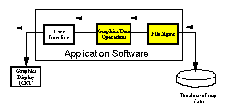

Figure 1.1 : Basic Architecture of GIS Products

Often, developers of GIS products will purchase the first
 two components (the ones shaded in yellow in Figure 1.1) and then
 write the third component based on the needs of a
 particular customer. The focus of this graduate project/
thesis was the converse of this approach. The objective
 was to study and then develop the first two components. The results
 are a software product called the Geographic Map System (GMS).

For this exercise the vector map system called Digital Chart
 of the World (DCW) was chosen. For
 this type of database, two software toolkits were produced. The first
 is called the GMS Extabula Toolkit (Extabula, Latin
 for "from the map/chart"). This toolkit corresponds to the File
 Management component (of Figure 1.1). It is used to read the
 information from the DCW database and prepare it so it can be
 manipulated by client software. The second toolkit is called the
 GMS DCW Graphics Toolkit and corresponds to the Graphics/Data
 Operations component (of Figure 1.1). Its function is to prepare
 the data from the first toolkit in such a way that it can easily
 be displayed by the user interface component of the GIS.

In addition to these two toolkits, a series of applications were developed
 to demonstrate some functionality of the GMS toolkits.  Although not
 overly sophisticated (compared to GIS products available on the market),
these applications exercise some of the core capabilities of the two toolkits.

# Chapter 2 - The DCW Database

2.1 Introduction:

The Digital Chart of the World (DCW) is
 a database of geographic information. The information is stored
 on 4 CD-ROMs and covers the entire earth. The DCW database was
 developed in the early 1990's by the National Imagery
 and Mapping Agency (NIMA). Other agencies that supplied source
 maps were the [9]:
```
    Australian Army Survey
    Canadian Directorate of Geographic Operations
    United Kingdom Military Survey.
    US Geological Survey 
```
At the time of the DCW project, NIMA was called the Defense Mapping Agency.

NIMA (http://www.nima.mil) is part of the US Department of Defense
(DoD). Its function is to provide geographic information to other
members of the Department of Defense. The purpose of the DCW product
is to provide a datbase of neutral format that can be used by several
different types of geographic information systems (GIS). The objective was to support GIS products in the military, scientific, and educational communities.

As mentioned in Chapter 1, the DCW database is
 a vector map system. The data is organized as
 tuples of longitude, latitude, and altitude (when
 applicable). For example, the political borders of a
 country are specified as an array of latitude/longitude
 pairs. The DCW database actually conforms to a rigorous
 definition that is called the Vector Product Format (VPF)
 and is specified in the document Mil-Std-2407. The VPF is
 a protocol of how certain types of vector map data are
 to be organized. A vector map system that conforms to the
 VPF standard is said to be VPF compliant. The DCW database is
 VPF compliant.

The DCW database was constructed using several types of paper
 maps. Specifically, the Operational Navigation Chart (ONC) map
 series and the Jet Navigation Chart (JNC) series were used. Rather
 than scanning these paper maps into raster images (as was done
 for the ADRG systems), the data from the ONC and JNC maps were
 further processed into vector data. The DCW database was constructed
 using 270 sheets of ONC map data (whose resolution is 1:1,000,000). The
 ONC map series was developed for the military and is typically used by
 pilots and planners. The DCW database was augmented using the JNC
 map series because the ONC series does not cover the region of
 Antarctica. The JNC series is also used for navigational
 purposes, but its resolution is less
 (than ONC) at 1:2,000,000 [9]. The companies that produced
 the DCW database for NIMA were:
```
    Environmental Systems Researth Institute, Inc.
    Loral Defense Systems (Akron OH)
    GEOVISION Inc. (Norcross, GA)
    Chicago Aerial Survey (Des Plaines, IL)
    Aerial Information Systems (Redlands, CA)
    Philips/Dupont Optical Disk Manufacturing (Wilmington, DE)
    Geocode (Eau Claire, WI) 
```
The DCW database contains supplemental information to the ONC and
 JNC maps. Information about airports was added using data called
 Digital Aeronautical Flight Information File (DAFIF). Also, the
 US Geological Survey provided information called Advanced Very
 High Resolution Radiometer (AVHRR) that describes vegetation. Two
 other map types were used to provide details about 355 world
 cities. These maps were the Joint Operations Graphic (JOG) and
 the Tactical Pilotage Chart (TPC) [9].


## 2.2 Architecture of the DCW Database:

As mentioned, the DCW database consists of 4 CD-ROMs. On each CD is
a series of directories (readable on DOS, UNIX, etc. systems) that
 are called libraries. Each library further contains subdirectories
 and eventually files of geographic data. Therefore, the term library
 is synonymous with directory.

The DCW is not a relational database in the way that
 Oracle ® and Sybase ® are constructed. However, the DCW does contain
 relational information. Furthermore, an effort was made to reduce
 the amount of duplicate information which is another characteristic of
 a relational database. However, in its simplest view, the DCW database
 is a hierarchy of flat files.

First, consider the highest-level libraries. The DCW database is
divided into 5 such libraries:
```
    NOAMER - North America
    EURNASIA - Europe and North Asia
    SOAMAFR - South America and Africa (and Antarctica)
    SASAUS - South Asia and Australia
    BROWSE - whole Earth 
```
The first four libraries (NOAMER, EURNASIA, SOAMAFR, and SASAUS) are called
regional libraries and contain detailed geographic information about a
specific area of the world. The BROWSE library contains high-level geographic
information about the entire earth. Each of the first 4 regional libraries is
installed on one CD-ROM (i.e. one regional library per CD). The browse
library is duplicated on each of the 4 CDs. This is described in Figure 2.1
below:

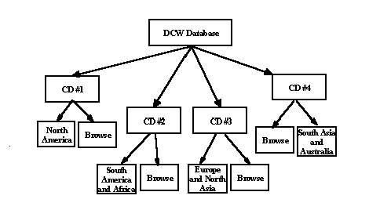 


At the root of each CD-ROM are two directories. One is the regional library (i.e. a directory called NOAMER, or SOAMAFR, etc). The other is the browse library (i.e. a directory called BROWSE). Recall that the browse library is duplicated on each CD.

### Themes (Coverages) in the DCW Database:
Each library (on a given CD) is further divided into what are
 called themes (also called coverages). These are categories of
 geographical information such as transportation, hydrology,
 and cities. A theme is also equivalent to a directory. Therefore, each
 theme is a subdirectory of a regional library. Each regional
 library contains 17 themes. The themes of a regional-library are
 summarized in Table 2.1 below:

   1. Aeronautical Information
      Directory Name : AE
      This directory contains details about civil and military airports.

   2. Cultural Landmarks
      Directory Name : CL
      This directory contains data about landmarks of significance
      for a specified region.

    3. Data Quality
       Directory Name : DQ
       This directory contains data about the resolution and accuracy of
       the geographic data in a specified region.

    4. Drainage Information
       Directory Name : DN
       This directory contains data about such geographic entities as
       glaciers, canals, aqueducts, wells, resevoirs, and dams.

    5. Drainage (supplemental)
       Directory Name : DS
       This directory contains additional drainage information about
       small lakes, and small islands of inland waters.

    6. Hypsographic Information
       Directory Name : HY
       This directory contains elevation data. Regions of equal elevation
       are specified. This data can be used to draw elevation contours on
       a map. Hypsography is the branch of geography dealing with the
       measurement of elevations above sea level.

    7. Hyspsographic (supplemental)
       Directory Name : HS
       This directory contains additional elevation data that was made
       available from different sources. For example, this directory
       typically contains information called spot elevation

    8. Land Cover Information
       Directory Name : LC
       This directory contains data about geographic entities such
       as rock quarries, strip mines, and oil fields.

    9. Ocean Features
       Directory Name : OF
       This directory contains data about exposed ship wrecks,
       lighthouses, and reefs.

    10. Physiography
        Directory Name : PH
        This directory contains data about physical geography. This is
        information about tectonic plates, fault-lines, etc.

    11. Political/Oceans
        Directory Name : PO
        This directory contains data about the boundaries of all
        the continents and the borders of countries.

    12. Populated Places
        Directory Name : PP
        This directory contains details of cities, towns, villages,
        and built-up areas.

    13. Railroads
        Directory Name : RR
        This directory contains data about single and multi-track
        railroad systems.

    14. Roads
        Directory Name : RD
        This directory contains data about highways, dual and single
        lane roads, trails, etc.

    15. Transportation Structures
        Directory Name : TS
        This directory contains data about commuter stations, highway
        overpasses, etc.

    16. Utilities
        Directory Name : UT
        This directory contains data about electical power plants,
        water pumping stations, and other utility systems.

    17. Vegetation
        Directory Name : VG
        This directory contains data about forests, fields, agricultural
        crops, etc. Most of the VG information is only available for
        North America due to the supplemental information provided
        by the USGS. 

The browse library is likewise divided into themes. However, there 
are 8 such themes. Some themes are the same as the regional libraries
 and some are unique to the browse library. In any case, there is less
 detail and resolution than in the regional libraries. The 8 themes of
 the browse-library are summarized in Table 2.2 below:

    1. ONC Compilation Date
       Directory Name : CO
       This directory contains data about the dates of ONC charts
       used in the DCW database.

    2. Data Volume
       Directory Name : DV
       This diretory contains information about the storage
       and memory requirements of the DCW database.

    3. Drainage
       Directory Name : DN
       This directory contains data about lakes, rivers, and
       inland water ways.

    4. Geographic Reference
       Directory Name : GR
       Describes the limits/boundaries of the browse data.

    5. Availability of Hypsographic Data
       Directory Name : DA
       This directory specifies the regions on the globe for
       which hypsographic data is defined (i.e. contained in the database).

    6. ONC Index
       Directory Name : IN
       Reference/Index to the ONC charts used in the database.

    7. Political/Oceans
       Directory Name : PO
       This directory contains data about the boundaries of the
       continents, countries, etc.

    8. Populated Places
       Directory Name : PP
       This directory contains general information about cities and towns. 

Before describing the architecture of the themes (i.e sub-directories), it
will be helpful to first describe what is called the Geographic Reference
System.

## The Geographic Reference System (GEOREF):
The GEOREF system is a coordinate scheme that partitions the earth into
equal sized regions. This system uses a flat-earth model and then
divides regions into equal sized areas called tiles. Each tile
is a 15° by 15° cell as shown in Figure 2.2 below:


There are 24 longitude zones identified by the
letters A through Z (except the letters I and O). The longitude zones
start at -180° and move to 180° in 15° increments. Also, there
are 12 latitude zones identified by the letters A through M (skipping I). The latitude zones start at -90° and move to 90° in 15° increments. A tile is identified by the tuple XY where X is the longitude zone and Y is the latitude zone. For example, the tile GJ is the area -90° .. -75° longitude and 30° .. 45° latitude (i.e. much of the eastern United States) [10].

Each tile is then further divided into smaller 5° by 5° sub-tiles. The longitude sub-tiles are numbered column-wise 1 through 3 and the latitude sub-tiles are numbered row-wise 1 through 3. The first tile is 11 and is in the lower left corner of the outer tile [10]. See Figure 2.3 below:

 


For example, much of the country of Spain is contained in the tiles MJ22, MJ23, MJ32, and MJ33

Tiling Scheme of DCW Database: Now, back to the DCW database. Data within a particular theme from a DCW library is partioned into a directory scheme based on the Geographic Reference System. The first series of sub-directories of a theme are the longitude-zones from the GEOREF system. Thus, there are one or more subdirectories named A, B, ... Z. Going into one of these sub-directories shows one or more directories that correspond to the latitude-zones (i.e. directories with names A, B, ... M). Continuing into the latitude sub-directories yields one or more sub-directories whose names correspond to the sub-tiles of the GEOREF system (i.e. directories with the names 11, 12, ... 33). Going into one of these sub-tile directories finally yields a series of files of raw geographic data (which will be described shortly). Therefore, certain data for a given region can be accessed by specifying the tiles. This directory hierarchy of the themes of the DCW database is shown in Figure 2.4 below:

 


This essentially describes the "skeleton" of the DCW database. It is how geographic information is distributed in the database.

Exceptions to the Rule: For a given regional library, there are 3 directories that are different. These directories are at the same level as the theme sub-directories. However, each directory simply contains files of raw geographic data. There is no application of the GEOREF tiling scheme to these directories. Table 2.3 summarizes the contents of these 3 directories:

    Gazetteer
    Directory Name : GAZETTE
    This directory is a geographic dictionary.

    Library Reference
    Directory Name : LIBREF
    This directory contains high level boundary data for a particular library. It specifies the general area of coverage for that library.

    Tile Reference
    Directory Name : TILEREF
    This directory contains what is called tile data. These are frames that define a region of the globe. (see Tiling Scheme of DCW Database below). 


Hence, in addition to the 17 thematic directories, each regional library contains these 3 sub-directories for a total of 20. The TILEREF directory is interesting because it contains the data that describes which GEOREF tiles are defined for the whole library. Hence, an application can use the data from the TILEREF directory to access data from any of the 17 themes. For example, the data from the TILEREF directory was used to construct the display of Figure 2.3 (above).

The Browse library also has a LIBREF directory. It specifies the boundaries of continents and countries for the whole globe (whereas the LIBREF of a regional library specifies only the geography of that particular region of the globe). For example, data from the LIBREF directory of the Browse library was used to construct the display of Figure 2.2 (above). Hence, in addition to the 8 thematic directories, each browse library contains this LIBREF sub-directory for a total of 9.

Now it is time to describe the files of this DCW architecture that contain geographic information.

2.3 Basic File-Types in DCW Database

The previous section described how the DCW database is organized (i.e. its architecture). However, it is the files within that architecture that contain the raw geographic information. This section describes the types of files found within that architecture. The files of the DCW database are classified into the following four categories:

    Database Tables
    Library Tables
    Primitive Tables
    Coverage Tables 

Note that the term table is equivalent to file. The database tables contain general information about the whole DCW database (i.e. are not specific to a particular library). The library tables contain information about a specific library (i.e. NOAMER, SOAMAFR, EURNASIA, SASAUS, or BROWSE). The primitive tables contain low-level geographic information (such as borders of countries, outlines of continents, etc) for a given library. The coverage tables contain descriptive information about a given region (such as soil conditions, maximum elevations, reefs, etc).

The Database Tables: As mentioned, the Database Tables give a general description of the whole DCW database. These files are duplicated on each CD-ROM and reside at the root directory. There are two database files:

    Database Header Table
    File Name : DHT

    Library Attribute Table
    File Name : LAT 


The Database Header Table contains general information of the DCW database such as its name, the mailing address of NIMA, and date of creation. It is essentially the title page of the database. The Library Attribute Table contains records that define the boundaries of each of the libraries.

The Library Tables: These files are placed in each of the library directories (e.g. SOAMAFR). These files give descriptions of the specified library (regional or browse). Each library directory consists of one copy of the following tables:

    Library Header Table
    File Name : LHT

    Coverage Attribute Table
    File Name : CAT

    Geographic Reference Table
    File Name : GRT

    Data Quality Table
    File Name : DQT

    Lineage Narrative Table
    File Name : LINEAGE.DOC 


The Library Header Table gives a general description of the particular library. It is like a title-page for that library. The Coverage Attribute Table lists each of the themes contained in the library. The names of the directories for each theme are also specified. It is like a table-of-contents for the library. The Geographic Reference Table contains information about the earth-model used to construct the data. For example, it specifies if the earth-model is ellipsoid and what the lengths are of the semi-major and semi-minor axes. The Data Quality Table lists attributes about the accuracy of the information in the database. For example, it specifies the absolute horizontal accuracy between points. The Lineage Narrative Table gives supplemental quality and accuracy information about the database and is written in a prose format. The browse library does not contain a LINEAGE.DOC file.

The Primitive Tables: These files contain low-level geographic information. First consider the following types of tables referred to here as core primitive tables. There are 4 types of these core tables and are described in Table 2.5:

    Edge Tables
    File Name : EDG
    An edge table contains information that defines borders of geographic items. Because edge tables contain variant-length records each EDG table is matched with a file called an index table. The index table is simply a list of offsets. There is one offset value for each edge record in the matching edge table. The offset specifies the start of the corresponding edge record. All edge index files are named: EDX.

    Text Tables
    File Name : TXT
    A text table contains the names of geographic regions (e.g. the name "Pacific Ocean"). A text record specifies the text/string and the [longitude, latitude] where the string is to be written on a map. Text tables are files with variant-length records (e.g. "Ohio" vs "Indian Ocean"). Therefore, text tables are matched with a text index table. Similar to the edge index table, the records of the text index specify the offset to the start of the text record. All text index tables are named: TXX.

    Face Tables
    File Name : FAC
    These tables are used to define a join relationship between a set of edges (from an edge table) and a feature table (which is described below). A region that is enclosed by a series of edges is called a face. Often, it is necessary to determine the features (i.e. characteristics) of that region. Such characteristics are defined in a feature table. The face table connects the region to those features.

    (Entity) Node Tables
    File Name : END
    These tables define a geographic object that is a single point (e.g. a water-tower). Each (entity) node record contains a foreign key to a feature table (described below). This pointer (i.e. foreign key) identifies what kind of geographic object the node is. For example, it identifies the node as a water-tower as opposed to an oil-well. Cities, towns, and villages are sometimes defined as (entity) nodes. 


There are 3 other types of primitive files. These files are used to support query functionality to the database. Often, a GIS product will allow an operator to specify a geographic region to be studied. These files allow applications to access data more quickly than by searching edge and node tables directly. These files are described in Table 2.6:

    Bounding Rectangles
    These files define the boundaries of many sets of edges and faces. Edge bounding rectangles (file name : EBR) define regions that enclose a set of edges (e.g. all the edges of the continent Australia). Face bounding rectangles (File Name : FBR) define regions that enclose a set of faces.

    Ring Tables
    File Name : RNG
    These tables define a series of concentric faces (i.e. a face inside a face, etc). Each record in a ring table references one face record (from a face table) and also one edge record (from an edge table). The edge record defines the first edge of the face. The first ring record defines the outer face. The next ring record defines the inner face, etc.

    Spatial Indexes
    Each spatial record defines a geographic region as well as a file offset into either an EDGE, TEXT, FACE, or NODE table. Thus, there are 4 types of spatial index files:
```
        Edge:
        File Name : ESI
        Text:
        File Name : TSI
        Face:
        File Name : FSI
        Node:
        File Name : NSI
 ```
For example, if an operator is allowed to ask, "what are all the nodes
within a specified region", a node spatial index file is searched to find a "matching region". If one (or more) is found then the index into the node table specifies the node (or nodes) that is of interest to the operator. 

The Coverage Tables: These tables contain descriptive information about a particular geographic entity. Also, these files are used in a relational method with respect to the primitive tables. These files allow GIS applications to implement functionality to allow an operator to query the DCW database, or to apply filtering of what information is displayed on a map.

As with the primitive tables, there are many instances of the coverage tables for each library. A theme will likely have several coverage tables, each of the same name, but located in different tiles (i.e. directories).

The coverage tables are further categorized into five sub-types. This hierarchy is described in Table 2.7:

    Value Description Tables
    A VDT is a list of text strings that describes (or names) geographic entities that were defined from a given core primitive table. VDTs and core primitive tables are related to each other. Feature tables (described below) are used to define the join relationship between a VDT and a primitive table. There are two types of value description tables:

        Integer:
        File Name: INT.VDT
        The records from an INT.VDT contain a unique ID and a string. The string is used to describe a geographic entity. For example, a given INT.VDT may be a list that describes geographic points as water-towers, or oil-wells, or railroad stations.
        Character:
        File Name: CHAR.VDT
        A CHAR.VDT (also) contains records of IDs and strings. However, instead of describing a geographic feature, these records give the name of it. Actually, each library in the DCW database has only one CHAR.VDT table, one in each PO theme. It lists the names of countries and their abbreviations (e.g. "Albania" is "AL"). 
    The rationale behind VDTs is to prevent duplication of data (in primitive tables).

    Feature Tables
    A feature table is used to associate value description tables with core primitive tables. Feature tables establish a join relationship between VDTs and core primitive tables. Thus, there are four types of feature tables described as follows. Note that the "*" in the file names that follow represent one of the themes of a library (e.g. AE, PO, RD, RR, etc):
        Point:
        File Name: *POINT.PFT
        Each record from a point-feature-table contains IDs (i.e. keys) that join records from node tables to records in value description tables. For example, given a node record that defines a populated point (i.e. from the PP theme). Along with the node table is a corresponding feature table called PPPOINT.PFT. Each record from this feature table specifies the ID of a node record and the ID of a record from a value description table. Thus, the node record is matched to a value-description record that specifies the point to be a "village".
        Text
        File Name: *TEXT.TFT
        Text feature tables join records from primitive text tables to records in value description tables. For example, given a text record from the drainage (DN) theme and let the text string be "falls". Along with the text table is the feature table called DNTEXT.TFT. Each record from this feature table specifies the ID of a text record (from the text table) and the ID of a record from a value description table. Thus, the text record is joined to a value-description record that specifies the text to describe a "running stream".
        Area
        File Name: *AREA.AFT
        Each record from a area-feature-table contains IDs (i.e. keys) that join records from face tables to records in value description tables. For example, given a face record that defines a geographic region (e.g. from the PO theme). Along with the face table is a corresponding feature table called: POAREA.AFT. Each record from this feature table specifies the ID of a face record and the ID of a record from a value description table. Thus, the face record can be identified as "polar ice" from the "Antarctic Area".
        Line
        File Name: *LINE.LFT
        Each record from a line-feature-table contains IDs (i.e. keys) that join records from edge tables to records in value description tables. For example, given an edge record that defines a railroad (i.e. from the RR theme). Along with the node table is a corresponding feature table called RRLINE.LFT. Each record from this feature table specifies the ID of an edge record and the ID of a record from a value description table. Thus, the edge record can be identified as a "single track" railway and its current status is "functional".
 
    Note that a theme has one or more feature tables based on the kind of primitive information contained in that theme. Consider the theme vegetation. In this theme there are only area feature tables since the theme describes areas of vegetation. A "corn field" is described as an area and can not be described as a line on a map. Also, consider the theme populated places (PP). This theme contains points since some populated locations are small enough to be represented as a point on a map (e.g. a village). Also, the theme contains areas that describe larger population centers (e.g. New York City). However, the theme does not contain line features since a population center can not be described as a line.

    Feature Class Schema Tables
    File Name : FCS
    There is one feature class schema table in each theme. The table describes what feature tables exist in a theme and what join relationships exists to the core primitive tables. The FCS table identifies the foreign keys between the primitive tables and the feature tables (and vice-versa).

    Narrative Tables
    File Name : * .DOC
    These tables describe each of the features (point, line, area, and/or text) within a given theme (VG, AE, RR, etc). The description is in a prose format so it is readable by an operator. This information augments the value description tables. 

Winged Edge Topology: The DCW database was constructed to support many different types of GIS products. Therefore, the DCW database was meant to be used for more than just drawing images on a computer screen. It was constructed to also support query capabilities. Consider the case where an operator wants to study the geography of the country Spain. As Figure 2.3 shows, the tiles MJ22, MJ23, MJ32, and MJ33 all contain information about this region of the globe. It would be the resposibility of a GIS product to retrieve all the geographic information from this region.

Winged-Edge Topology is an algorithm that allows information to be retrieved about geographic entities that are separated across tiles. A better name would probably be Cross Tile Retrieval System, but Mil-Std-600006 defines it otherwise.

A given edge table can be read from top to bottom and the points used to display lines on an image. However, this does not define the "areas" of a map. If regions are to be distinguished by shading/coloring, it is necessary to know the "areas" defined in the edge table. Furthermore, many "areas" cross from one sub-tile to another. The Winged-Edge Topology Algorithm uses additional information in each edge record to determine which edge records are "connected" to a given edge record. Also, if the "neighbors" of an edge record reside in another edge table, that edge table can be "interpreted" from the current edge record. Thus, the Winged-Edge Topology Algorithm provides a means to concatenate edge records into a polygon that represents a geographic area.

## 2.4 Basic Data-types of the DCW Database:

Any file in the DCW database consists of one or more records. Each record is constructed from a primitive data type such as a 32-bit integer, or 32-bit floating point value. Table 2.8 lists each of the primitive data types used in the DCW database.
```
Data Symbol 	Description
T 	String of n characters
F 	32-bit floating point
R 	64-bit floating point
S 	16-bit integer (i.e. short)
I 	32-bit integer
C 	Two dimensional coordinate (x, y) (two 32-bit floats)
B 	Two dimensional coordinate (x,y) (two 64-bit floats)
Z 	Three dimensional coord (x, y, z) (three 32-bit floats)
Y 	Three dimensional coord (x, y, z) (three 64-bit floats)
D 	Date - 20 character string "YYYYMMDDhhmmss.xxxxx"
X 	NULL field (i.e. will be defined in future releases)
K 	Triplet-ID record (see below)
```
Except for triplet-id record, each of the data types listed corresponds to data types that are directly supported by programming languages. But for some reason, the designers of the DCW database decided to be unnecessarily complex with respect to the triplet-id as a data type.

The Triplet ID Record: This data type is found in edge records and is used in support of the winged-edge-topology algorithm. It is a way to specify the locations of the Left Face, Right Face, and Left Edge of a given edge record. Three values are specified in a triplet-id record:

    Primitive ID
    Tile ID
    External Primitive ID 

The Primitive ID specifies the ID of a joining record (face or edge) within the current tile. The Tile ID specifies the ID of a joining record (face or edge) that is outside of the current tile (i.e. the edge or face record resides in a table that is in a different tile). The External Primitive ID specifies the ID of the record from that external table.

A triplet-id record is a sequence of bytes. The first byte, called the type byte, is used to specify a syntax that defines the values for the Primitive ID, the Tile ID, and the External Primitive ID. The type byte is divided into four 2-bit sections. The first two 2-bit section indicates how many bytes are used to define the value of the Primitive ID. The second 2-bit section indicates how many bytes are used to define the Tile ID. The third 2-bit section indicates how many bytes are used to define the value of the External Primitive ID. The fourth 2-bit section is not used. Each 2-bit section will have a value of 0, 1, 2 or 3 that indicates how many bytes follow the type byte. The number of bytes for each value is shown in Table 2.9:
```
2-bit Value 	Number of Bytes
0 	0
1 	1
2 	2
3 	4
```

For example, if the type byte is 01_00_00_00, then there is one byte following the type byte and it is used to define the value of the Primitive ID. Furthermore, no values are specified for the Tile ID nor the External Primitive ID. If the type byte is 00_11_10_00, then there are 4 + 2 bytes following the type byte. The first four bytes are used to define the value for the Tile ID and the last two bytes are used to define the External Primitive ID. Note that there is no value for the Primitive Id for this case.

Although there are 64 different combinations possible with a triplet-id record, the actual number encountered is fewer. This is because if a Primitive ID is specified, then the corresponding record is in a file that is co-resident in the tile. Thus, the Tile ID and the External Primitve ID are not applicable. Also, if the record is in another tile, then the Primitive ID value will not be specified but both the Tile ID and the External Primitive ID must be specified.


## 2.5 Basic Format of DCW Files

Each file in the DCW database consists of two sections, the header and the body. The first four bytes of the header is an integer specifying the size (in bytes) of the header section. Then, the header describes the format of the records in the body of the file. The body is one or more records of geographic or relational data. The Data Symbol column in Table 2.8 (above) is important because those symbols are used in the header section of each file. The data type of each attribute of a record is defined using one of those symbols.

As an example of a header, consider the definition of an entity node
record (from an entity node table).
```
xxxx;

Entity Node Primitives;-;

ID=I, 1,P,Row Identifier,-,-,:

POPOINT.PFT_ID=I, 1,F,Foreign Key to Point Feature Table,-,-,:

CONTAINING_FACE=I, 1,F,Foreign Key to Face Table,-,-,:

FIRST_EDGE=X, 1,N,Foreign Key to Edge Table (null),-,-,:

COORDINATE=C, 1,N,Coordinates of Node,-,-,:;
```

A bit of "doctoring" has been done here for readability purposes. For example,
the carriage returns are not present in any of the DCW files. The xxxx
symbolizes the 4-byte integer that defines the size of the header section. The
next item is the name of the record, Entity Node Primitives. If a narrative
table (*.doc) had been associated with this node table, then the name would
have been specified after the name of the record. Next, the format of the
record is defined. The general syntax is:
[attribute]=[data-type],[num-elements],[key-type],[vdt],[theme-index]: For example, the attribute:
```
CONTAINING_FACE=I, 1,F,Foreign Key to Face Table,-,-,:
```
specifies an attribute with the name "CONTAINING_FACE" whose data type is
Integer (32-bit). The attribute is one integer long. The F indicates
that the attribute is a foreign key and the description indicates
how the key is used. The fifth specifier is simply
a - and indicates that no Value Description Table (VDT)
applies. The sixth specifier is also a - and indicates
that no thematic-index table applies. Attributes that are
of varying length would be indicated by the symbol * for
[num-elements] (third specifier). For example,
character strings and arrays of latitude/longitude coordinates are specified
this way. All definitions of attributes are terminated by the
symbol :. The end of the header section is indicated by
the consecutive symbols :;.

As an example, the above record would have the following C struct:
```
typedef struct
   {
       int ID;
       int fgnKeyToPntFeatureTbl;
       int fgnKeyToFaceTbl;
       float coordLongitude;
       float coordLatitude;
   } nodeRecType;
```
where the attribute FIRST_EDGE is not included since (as Table
2.10 shows) the attribute does not exist for this
version of the DCW database and is reserved for furture versions.

# Chapter 3 - The GMS Extabula Toolkit

3.1 - Objectives and Requirements

Fundamentally, any GIS product needs the ability to read geographic
data from a given database. This is the purpose of
the GMS Extabula Toolkit (Extabula, latin for "from
the map/chart"). The general objective is for the
toolkit to read each of the types of files from the
DCW database and to build data structures that can be manipulated
by client software. Figure 3.1 illustrates the overall system.

The GMS DCW Extabula Toolkit is shaded. The toolkit is essentially provides an interface to the DCW database for higher level clients. To achieve this objective the following requirements are specified:

    A series of utilities shall be developed to read the data from the files of the DCW database.
    Access to the following types of files shall be provided:
```
        Database Level Tables:
            Database Header Table
            Library Attribute Table 
        Library Level Tables:
            Library Header Table
            Coverage Attribute Table
            Geographic Reference Table
            Data Quality Table 
        Primitive Tables:
            Edge Tables
            Face Tables
            Text Tables
            Node Tables
            Index Tables
            Bounding Rectangles (both Edge and Face)
            Ring Tables 
        Coverage Tables
            Value Description Tables (Integer and Character)
            Feature Tables (Area, Point, Text, and Line)
            Feature Class Schema Tables
            Thematic Index Tables
            Spatial Index Tables 
```
    Data structures that correspond to each of the types of files shall be defined to allow client software to process/manipulate the data.
    The utilities shall be written in ANSI C.
    The utilities shall be compilable by ANSI C and ANSI C++.
    The utilities shall be portable to the following platforms:
```
        MS Windows 98
        MS NT
        HPUX UNIX (Hewlett-Packard)
        Sun-Solaris UNIX 
```


## 3.2 - Architecture and Design

The GMS Extabula Toolkit consists of a series of components. A component is a C header file and a C source-file of the implementation. The header file defines the interface for the client and the source-file is the implementation. Each component provides the ability to read a file from the DCW database. A data structure is also defined in the header file. It defines the C language format of the file for the client. There is no coupling between components that access a particular kind of DCW file.

Two common/global components are defined. The first is a header file of type declarations and useful constants. It is called gmsTypesAndConstants.h. The second component is a series of utilities that are used by the other components. It is called gmsUtilities.h/c. For example, a type that defines record of latitude and longitude are defined as well as a function to read one such record given a file descriptor.

Coupling between components is minimized because each component is dependent only on the two common components and the ANSII Standard C Library.

The interface of each component (i.e. its header file) is fairly simple. A data structure type is defined along with two functions. The first is a get routine. This function reads a DCW file and builds a data structure based on the contents of the specified file. The file to be read is specified using a string. It is the full path to the DCW file. Memory is allocated from the heap and a pointer to the data structure is returned to the caller. The second routine is a free routine. It de-allocates the memory of the object by returning it to the heap. The client calls this function when the data is no longer needed. Each component also contained a function to print the contents of the data structure to standard output (stdout). These were built only to support debugging and testing. Clients will likely be graphics based so output to the console will probably not be useful (especially for Windows GDI applications for which no console output is defined).

The components were designed to be archived into static libraries. Since the toolkit is really only useful by higher level client software, it is easier to present as simple an interface (i.e. the header files) as possible and allow the client to link against a static library.

## 3.3 - Implementation

As mentioned, there are two common components of the toolkit. The remaining components are categorized based on the types of DCW files they process.

Common Types and Utilities: As mentioned, two common components were defined to support the other components of the toolkit. They are listed in Table 3.2.
```
Header 	Source (Implementation)
gmsTypesAndConstants.h 	n/a
gmsUtilities.h 	gmsUtilities.cpp
```

The gmsUtilities.h/c essentially simplifies accessing data from a DCW file. Several functions exist to read data that is based on the primitive data types of the DCW database (see Table 2.8). For example, there is a routine

twoDimCoordType gmsReadTwoDimCoord (FILE *theFd);

that returns a record of latitude and longitude to the caller. This is useful for reading coordinate values. It saves the caller from having to deal with reading two float values each time a coordinate record is to be read.

Also, portability is abstracted away from the client by using the gmsUtilities.h interface. For example, reading an integer is typically not complex. But this becomes more involved in the presence of different machine architectures (i.e. the old big-endian vs little-endian problem). The routine

int gmsReadInteger(FILE *fd);

returns an integer from the DCW file being read. Swapping of bytes is done internally if required by the machine architecture. Although not dynamic, a pre-processor option called BIG_ENDIAN is used to compile the required section of code. Thus, the software can be compiled/linked on a HP-PARISC machine (big-endian) or on an x86 based machine (little-endian) without having to modify code.

Also, there is a utility that reads a triplet-id record. A component that uses the function:

idTripletType gmsReadIdTripletRecord (FILE *theFd);

is freed from the complexity of reading this data type (as described in chpt 2, section 2.4) as well as the details of big-endian vs little endian.

Database Tables: Since there are two database-level tables (DHT and LAT), there are two components to access these tables. These components are listed in Table 3.3:
```
Header 	Source (Implementation)
gmsDbHeaderTable.h 	gmsDbHeaderTable.cpp
gmsLibAttribTable.h 	gmsLibAttribTable.cpp
```


The gmsDbHeaderTable.h/c reads the contents of the DHT file and the gmsLibAttributeTable.h/c reads the contents of the LAT file.

Library Tables: Table 3.4 lists the components used to access the Library Tables:
```
Header 	Source (Implementation)
gmsGeoReferenceTable.h 	gmsGeoReferenceTable.cpp
gmsLibHeaderTable.h 	gmsLibHeaderTable.cpp
gmsCoverageAttribTable.h 	gmsCoverageAttribTable.cpp
gmsDataQualityTable.h 	gmsDataQualityTable.cpp
```


These utilities can be used to read library files from regional libraries as well as the browse library. For example, there are two library header tables (LHT) on each CD. The first is from the regional libarary and the second is from the browse libary. There are two Geographic Reference tables on each CD-ROM. The first is from the regional libarary and the second is from the browse libary.

Primitive Tables: There are four components used to access core primitive tables (edge, text, node, and face tables). Also included is a component to access index files that are used to access core primitive files. These components are listed in Table 3.5.
```
Header 	Source (Implementation)
gmsEdgeTable.h 	gmsEdgeTable.cpp
gmsTextTable.h 	gmsTextTable.cpp
gmsNodeTable.h 	gmsNodeTable.cpp
gmsFaceTable.h 	gmsFaceTable.cpp
gmsIndexFile.h 	gmsIndexFile.cpp
```


Client applications will not need to access an index file directly. Rather, when the client specifies a core primitive file (edge, text, node, or face), the component determines the index file that is to be used. The object of the primitive data is constructed while access to the index file is hidden from the client.

There are three primitive support utilities to access ring tables, bounding rectangles, and spatial index tables. These are listed in Table 3.6
```
Header 	Source (Implementation)
gmsRingTable.h 	gmsRingTable.cpp
gmsMinBoundRectTable.h 	gmsMinBoundRectTable.cpp
gmsSpatialIndex.h 	gmsSpatialIndex.cpp
```


The gmsMinimumBoundingRectangle component is used to read both Edge Bounding Rectangles and Face Bounding Rectangles. These two types of files are often called minimum bounding rectangles in the DCW documentation.

Implementation Issues: Construction of edge tables proved to be complex. One
problem is that the records of edge tables are variant-records. This means
that the format of the record was different for tables in different
themes. Consider the generalized definition of an edge record shown
in Table 3.7:
```
ID =I,1,P,Row Identifier - Mandatory

*LINE.LFT_ID =I,1,F,Fgn Key to Line Feature Tbl - variant

START_NODE =I,1,F,Start/Left Node - Mandatory

END_NODE =I,1,F,End/Right Node - Mandatory

RIGHT_FACE =K,1,F,Right Face - variant

LEFT_FACE =K,1,F,Left Face - variant

RIGHT_EDGE =K,1,F,Right Edge from End Node - Mandatory

LEFT_EDGE =K,1,F,Left Edge from Start Node - Mandatory

[num-coords] =I,1,N,Number of coords in array - Mandatory

COORDINATES =C,*,N,Coordinates of Edge - Mandatory
```


Table 3.7 shows that edge records are variant records because some of the attributes (*LINE.LTF_ID, RIGHT_FACE, and LEFT_FACE) are not present in some edge tables. These attributes are implemented for some themes and not for others. Furthermore, for some edge records, one or two of the variant attributes are present while another is not.

It turns out that there are four variants to the edge record. The first variant is described in table 3.8.
```
ID =I,1,P,Row ID,-,-,:

START_NODE =I,1,N,"Start/Left Node",-,-,:

END_NODE =I,1,N,"End/Right Node",-,-,:

RIGHT_FACE =K,1,F,Right Face,-,-,:

LEFT_FACE =K,1,F,Left Face,-,-,:

RIGHT_EDGE =K,1,F,Right Edge from End Node,-,-,:

LEFT_EDGE =K,1,F,Left Edge from Start Node,-,-,:

[num-coords] =I,1,N,Number of coords in array

COORDINATES =C,*,N,Edge Coordinates,-,-,:;
```

The format from Table 3.8 describes the edge records from the following
regional themes: VG, TileRef, PP, LC. Also, this format applies to edge
records from the browse library.

```
The second variant is described in table 3.9.

ID =I,1,P,Row Identifier,-,-,:

*LINE.LFT_ID =I,1,F,Foreign Key to Line Feature Table,-,-,:

START_NODE =I,1,F,Start/Left Node,-,-,:

END_NODE =I,1,F,End/Right Node,-,-,:

RIGHT_EDGE =K,1,F,Right Edge from End Node,-,-,:

LEFT_EDGE =K,1,F,Left Edge from Start Node,-,-,:

[num-coords] =I,1,N,Number of coords in array

COORDINATES =C,*,N,Coordinates of Edge,-,-,:;
```

Note that in Table 3.9 the * for the foreign key to the line-feature table indicates the theme. The format of Table 3.9 applies to the edge records from the following regional themes:
```
    UT, TS, RR, RD, PH, OF, HS 

The third format is described in Table 3.10.

ID =I,1,P,Row Identifier,-,-,:

*LINE.LFT_ID =I,1,F,Foreign Key to Line Feature Table,-,-,:

START_NODE =I,1,F,Start/Left Node,-,-,:

END_NODE =I,1,F,End/Right Node,-,-,:

RIGHT_FACE =K,1,F,Right Face,-,-,:

LEFT_FACE =K,1,F,Left Face,-,-,:

RIGHT_EDGE =K,1,F,Right Edge from End Node,-,-,:

LEFT_EDGE =K,1,F,Left Edge from Start Node,-,-,:

[num-coords] =I,1,N,Number of coords in array

COORDINATES =C,*,N,Coordinates of Edge,-,-,:;
```


The format described in Table 3.10 applies to the following regional themes: PO, HY, DQ, DN, CL.

The fourth format is described in Table 3.11. It applies only to edge tables from the LIBREF directory of regional libraries.
```
ID =I,1,P,Row Identifier,-,-,:

START_NODE =I,1,F,Start/Left Node,-,-,:

END_NODE =I,1,F,End/Right Node,-,-,:

RIGHT_EDGE =K,1,F,Right Edge from End Node,-,-,:

LEFT_EDGE =K,1,F,Left Edge from Start Node,-,-,:

[num-coords] =I,1,N,Number of coords in array

COORDINATES =C,*,N,Coordinates of Edge,-,-,:;
```
The next problem with implementing the edge table component was that edge records are variant-length records. Again consider the generalized format of edge records shown in Table 3.7. The COORDINATES attribute is an array of coordinate tuples whose length is different for each record. The attribute [num-coords] is not defined in Mil-D-89009, nor in Mil-Std-600006, nor in Mil-Std-2407. Now, by using the index file the software can determine where the start of each edge record is located. Thus, the number of coordinates could be calculated for each record (total-length - size of fixed components). When this was done, the software was always off by 4 bytes. It turns out that the extra 4 bytes is an integer that indicates the length of the coordinate array. The actual implementation (i.e. the data written on the CD-ROM) includes this extra attribute that was discovered by accident (by trial and error).

Futhermore, it was discovered that all variant-length attributes were preceded by an integer that indicated the length of the array (e.g. strings from text tables).

The component gmsTextTextTable is used to access text tables. There are two variants handled by this component. One is for the browse library and the other is for the regional libraries. The string that is read from the text table is appended with the ASCII null character for easier use by the client.

The component gmsFaceTable is used to acces face tables. Like the text tables there are two variants for the face tables; one for the browse library and the other for regional libraries.

The component gmsNodeTable is used to acces (entity) node tables. There are three variants for the node tables; one for the browse library, one for the gazette directory, and the third for themes of regional libraries.

Coverage Tables: There are six components used to access coverage tables. These are listed in Table 3.12

Header 	Source (Implementation)
gmsFeatureTypes.h
gmsFeatureTable.h 	gmsFeatureTable.cpp
gmsBrowseFeatureTypes.h
gmsBrowseFeatureTable.h 	gmsBrowseFeatureTable.cpp
gmsValueDescriptionTable.h 	gmsValueDescriptionTable.cpp
gmsNarrativeTable.h 	gmsNarrativeTable.cpp
gmsFeatureClassSchemaTable.h 	gmsFeatureClassSchemaTable.cpp
gmsThematicIndex.h 	gmsThematicIndex.cpp


There are two components for accessing feature tables. One is for feature tables from the regional libraries and the other is for the browse libraries. Implementation of these components was not trivial because there are several variants. First is the distinction between records from point, line, area, and text feature tables. Then, much like the case for the edge records, there were variations in the records depending upon the theme. It turns out that there are 8 variants to records from point feature tables, there are 5 variants to the area feature records, and there are 4 variants for the line feature records. The text feature record was easiest to implement because there was only one format for these tables. Furthermore, for the browse library, there are two variants for the area feature table.

The gmsValueDescriptionTable component is used to access both integer and character VDTs. Actually, there are two sub-types of CHAR.VDTs. One is specific to the browse library and the other is used for the regional libraries. The component determines which type of data structure to build based on the location of the CHAR.VDT that is specified.

The gmsThematicIndex component is used to access thematic index files. For some reason, the designers of the database decided that thematic index files could have offset values as byte, short-int (16-bit), or integer (32-bit). Therefore, the thematic index structure is constructed based on the size of the offset value encountered in the file.

Implementation of the narrative table and feature class schema table components was not as complicated.


## 3.4 - Testing

Testing of the components was performed before beginning development of the graphics toolkit (described in Chapter 4). The test drivers that were developed to test the GMS Extabula Toolkit were console based applications. No graphics programming was developed since this was not necessary to verify the functionality of these components.

Test drivers were developed to exercise each of the components of Tables 3.3, 3.4, 3.5, 3.6, and 3.12. Some test drivers exercised more than one component. Some were targeted to exercise one component. For example, the test driver po_test was designed to exercise each of the types of files in the Political/Oceans (PO) theme of a library. On the other hand, the test driver feature_test was designed to test only feature tables from any theme.

The output from the test drivers was generated using the print utilities provided with each component. These utilities used the data structure and converted the records to an ASCII readable format. The output was sent to standard output (stdout) of the console. Often, the output was captured to a text file. Success of testing was based on the following criteria. First the output was read to see if it made any sense. For example, were latitude values between -90.0° and 90.0°? Were longitude values between -180.0° and 180.0°? Were the names of countries and cities in text strings valid? Second, the output was then compared the values from a set of known tables. These known tables were provided from the documents Mil-D-89009, Mil-Std-600006, and Mil-Std-2407. This was particularly useful in verifying the output from testing the feature tables.

Part of the testing scheme included building static libraries of the GMS Extabula Toolkit and then linking test drivers against the static libraries. Most of the development of the toolkit was done on a Windows 98 platform using Microsoft Visual C++ (v 6.0). However, the toolkit and test drivers were eventually ported to UNIX platforms (HPUX and SUN Solaris) and tested using an ANSII C compiler. Testing was simplified by building and linking against static libraries on these platforms. More details of this are given below.

Portability: One of the requirements was to develop the toolkit so that it is portable to more than one platform. Specifically, the following operating systems were targeted:
```
    Microsoft Windows 9x
    Microsoft NT
    Hewlett-Packard : HPUX
    Sun - Solaris 
```
As mentioned, the test drivers described above were developed and linked using Microsoft's Visual C++. Testing was performed using Windows 98. After successful testing was achieved, the tests were ported to a Windows NT computer. All of the tests were re-executed on the NT system.

Next, the software was transferred (File-Transfer-Protocol) to an HPUX platform. The GMS Extabula Toolkit was built into a static library and the test drivers were compiled and linked against the static library. Also, the SOAMAFR portion of the DCW database was transferred to the test site. The tests were successfully repeated.

Next, the software was transferred to a Sun-Solaris platform. The build process used for testing on the HPUX platform was duplicated on the SUN-Solaris platorm. The tests were then successfully repeated.

Conclusion: Testing showed a stable toolkit on all platforms. At this point, development shifted to the next toolkit called the GMS DCW Graphics Toolkit.

# Chapter 4 - The GMS DCW Graphics Toolkit

4.1 - Objectives and Requirements

The second main component of GIS products is the Graphics/Data Operations. The objective of this module is to provide a set of utilities that manipulate the geographic data so it can be presented to an operator. Also, most GIS products include functions that perform analytic services for an operator [17]. The Graphics/Data Operations component is sandwiched between the utilities that directly access the database and the user interface. This is illustrated in Figure 4.1.

 

The objective of GMS DCW Graphics Toolkit is to manipulate the data structures from the GMS Extabula Toolkit in such a way as to be useful to several types of user-interface applications. To acheive this the requirements of Table 4.1 were defined. Several of the requirements make reference to earth models (e.g. ECEF, and WGS84). These will be described in more detail in section 4.2.

    The GMS DCW Graphics Toolkit shall provide a series of utilities to convert a given [Longitude, Latitude] coordinate to coordinates based on each of the following grid systems:
        Flat earth
        Earth-Centered-Earth-Fixed (ECEF) 
    Utilities to generate ECEF coordinates based on a spherical earth model and the WGS84 ellipsoid model shall be provided. The radius of the spherical model shall be 6,378,137.0 meters.
    Utilities to rotate an ECEF coordinate around the x, y and z axes shall be provided.
    An abstract screen coordinate system shall be used. This coordinate system shall only assume the client software to be a raster graphics system (i.e. pixel based). No other assumption about the graphics package of the client shall be assumed. In other words, it shall not be assumed that the graphics toolkit of the client is GKS, nor MS Windows GDI, nor X Window System, etc.
    A utility to convert a given ECEF coordinate to a 3D screen coordinate shall be provided.
    Utilities to project a given 3D screen coordinate into a 2D screen coordinate shall be defined.
    Utilities to translate 2D and 3D screen coordinates shall be provided.
    Utilities to rotate 3D screen coordinates about the x, y and z axes shall be provided.
    Utilities to generate a grid of lat/long lines shall be provided. These utilities shall:
        allow the client to specify the number of latitude (i.e. parallel) and longitude (i.e. meridian) lines the grid is to contain,
        allow the client to specify which earth model (i.e. flat vs ellipsoid) is used to generate the grid lines. 
    Utilities to zoom in/out the screen coordinates shall be provided.
    The utilities shall be written in ANSI C++.
    The utilities shall be portable to the following platforms:
```
        MS Windows 98
        MS NT
        HPUX UNIX (Hewlett-Packard)
        Sun-Solaris UNIX 
```


## 4.2 - Algorithms

One of the important functions of this toolkit is to convert a given [longitude, latitude] coordinate into a corresponding two dimensional (x, y) or three dimensional (x, y, z) coordinate. The two and three dimensional coordinates are much easier to manipulate for computer graphics operations. To support this, requirements were specified to develop utilities that support three types of coordinate systems. These three coordinate systems are the flat earth model, the spherical earth model, and the ellipsoid model. These systems are described as follows.

Flat Earth: This model is useful to applications that display the earth as a flat map. This model is essentially an application of the Mercator Projection (introduced in Chapter 1). A sphere (i.e. the earth) is placed in the middle of a cylinder. All points on the sphere are projected onto the wall of the cylinder [3]. This is illustrated in Figure 4.2.

 

The cylinder is then un-ravelled and laid flat, thereby giving a flat earth. The circumference of the cylinder is the same as the sphere. The range of the x-coordinate is:
```
- Pi * Re .. Pi * Re
```
where Re is the radius of the earth. Also, the height of the cylinder is twice the radius of the sphere which is 2 * Re. Hence, the range of the y-coordinate is:
```
- Re .. Re
```
The value of x is therefore calculated from
```
x = longitude * (Pi * Re / 180)
```
Also, the value of y is therefore
```
y = Re * sin(latitude)
```
Accuracy of maps based on this model decreases as the latitude moves towards the poles. Such maps typically show severe distortions at the poles. For example, Antarctica is exceptionally large because it sweeps across the bottom of the map. Also, countries like Greenland are shown to be excessively large [1].

Spherical Earth: This model considers the earth to be a perfect sphere. Although not as accurate as the ellipsoid model (described below), it is sufficient for many applications. For this model, it is necessary to define a common frame of reference. Hence, the earth is centered in a right-handed orthogonal coordinate grid. The center of the earth is the origin of this coordinate grid. The y-axis is the line between the North and South poles running through the center of the earth. Positive y values are on the hemisphere of the North Pole. The prime meridian is the arc from the North Pole, passing through Greenwich, England, and concluding at the South Pole. The z-axis is the line that intersects both the prime meridian and the center of the earth, and is perpendicular to the y-axis. Positive z values are on the hemisphere of the prime meridian. The x-axis completes the right-handed coordinate system [11]. This is illustrated in Figure 4.3.

 


Using Figure 4.3 as reference, the derivation of any (x, y, z) from a given [longitude, latitude] value is straight forward. Therefore:
```
x = Re * cos(PHI) * sin(LAMBDA)

y = Re * sin(PHI)

z = Re * cos(PHI) * cos(LAMBDA)
```
where Re is the radius of the earth, PHI is latitude and LAMBDA is longitude.

The World Geodetic System - 1984: Before describing the third coordinate model
it will be helpful to describe an earth reference system called the World
Geodetic System - 1984 (WGS84) [11]. For some applications, modeling the earth
as a flat rectangle, or a sphere, or an ellipsoid is not sufficient. Some
systems need a highly accurate model. The WGS-84 was developed for these
systems.

The WGS-84 system begins by modeling the earth as an ellipsoid. Like the spherical model described above, there is a reference coordinate system. However, it is based on a coordinate system defined by the International Earth Rotation Service (IERS). It is essentially the same as the grid described above, except the names of the axes are exchanged (e.g. the z-axis in the IERS system is the y-axis in the spherical model). The WGS-84 ellipsoid is centered in the IERS coordinate system [11].

Coordinates in the WGS-84 system are given in tuples of [longitude, latitude]. However, the values specified are called geodetic coordinates because they are generated by making what are called geodetic measurements from selected regions on the earth. A geodetic measurement is obtained by selecting a central reference point within a region on the earth (also called a station frame). The longitude and latitude of that point is calculated by defining a line perpendicular to the earth that passes through the center of a reference ellipsoid. Measurements of distance from the central point are used to calculate all other points within the region. The position measurements are performed using satellites and variations in gravity. All points within that region are said to comprise a geodetic datum. The WGS-84 system is actually a database of many hundreds of geodetic datums from areas all over the earth [11].

Now, lat/long coordinate values from a geodetic datum are highly accurate. However, these values are with respect to an ellipsoid that perfectly coincides with that region. Moving to another geodetic datum causes another reference ellipsoid to be used. Thus, in the WGS-84 system, there are actually two types of coordinates. The first is the previously mentioned geodetic and the other is called geocentric. The geodetic coordinates are the values for a particular geodetic datum. The geocentric coordinates are values from the IERS reference ellipsoid [11]. The difference between these two types of coordinates is illustrated in Figure 4.4 [11].

 


Thus, it is necessary to convert geodetic coordinates to geocentric coordinates. This permits the use of a common reference ellipsoid for geographic systems. The WGS-84 reference ellipsoid is illustrated in Figure 4.5. Note that for consistency with the spherical model (described above), the x, y, and z axes of Figure 4.5 were made to coincide with the axes of Figure 4.3. This is different from how the IERS labels the axes.

 


The equations to convert a given geodetic coordinate to an (x, y, z) geocentric coordinate are given in Figure 4.6 [11].
```

   x = (N + h) * cos(PHI) * sin(LAMBDA)

         b * b
   y = (------- * N + h) * sin(PHI)
         a * a

   z = (N + h) * cos(PHI) * cos(LAMBDA)

   where:
      PHI = geodetic latitude
      LAMBDA = geodetic longitude
      h = altitude
      a = semi-major axis = 6378137.0 meters
      b = semi-minor axis = 6356752.0 meters
      N = a / sqrt(1 - e * e * sin(PHI) * sin(PHI))
      e = first eccentricity = sqrt(2 * f - f * f)
      f = earth-flattening = (a - b) / a
```


Thus, the input values are PHI and LAMBDA. For the toolkit being developed, the value of h (altitude) will be zero for all cases. The values of a (semi-major axis) and b (semi-minor axis) are fixed based on the reference ellipsoid. The remaining values are derived. Some, such as flattening are constants since they are derived from other constants [11] [3].

Ellipsoid Earth: The [longitude, latitude] values from the DCW database are geodetic coordinates based on the WGS-84 model. Thus, the equations described in Figure 4.6 are used for the toolkit.

A note about the ellipsoid model. Although the [long, lat] coordinates from the DCW database are geodetic coordinates, the conversion to geocentric coordinates is overkill in some cases. Depending on the zoom factor and considering the highest scale of the DCW database is 1:1M, it is hard to distinguish between the spherical model and the ellipsoid model.

Screen Projection: For the spherical and ellipsoid models, the 3 dimensional points must then be projected onto the 2 dimensional screen. To support this a projection algorithm was implemented in the toolkit. The projection of any arbitrary 3D point P(x, y, z) onto a 2D screen gives the point P*(x*, y*). This scheme is illustrated in Figure 4.7 below [5].

 


Manipulating the following ratios,
```

   | a - x |      | a - x* | 
   ----------- = ------------ 
     k + z            k 

   | y - b |      | y* - b | 
   ----------- = ------------ 
     k + z            k 
```
yields the following projection equations [5]:
```

         a z + k x
   x* = ------------
          k + z


         b z + k y
   y* = ------------
          k + z
```

4.3 - Architecture and Design

A mix of objected oriented and structural methods were used to develop the DCW Graphics Toolkit. Several components were designed as utilities and maintained little or no state information. For example, the software to manipulate coordinates and perform screen projection were implemented as utilities. Other components were designed as object oriented classes. For example, a class called gmsMapClass treats regions of data as a map object. The client would instantiate one or more map objects depending on how much area was of interest.

A core component of the DCW Graphics Toolkit is the gmsMapStateMgr. Its purpose is to record any changes to the state of a map requested by the client application. These include changes in zoom factor and orientation of the map. This keeps all maps in the same state for presentation to an operator. This componenent was designed as an abstract state machine since it maintains the current state of the map.

One of the design objectives was to keep coupling between components to a minimum. The components of the DCW Graphics Toolkit depend on the components of the Extabula Toolkit, but this is to be expected. Also, there are dependencies of components within the DCW Graphics Toolkit. For example, most components use the coordinate utilities. As with the Extabula Toolkit, the DCW Graphics Toolkit was also designed for portabilty. Thus the only other dependencies are on functions from the ANSI C++ library.

Another design objective was to implement simple interfaces to the components and to use the principle of information hiding. Since the objective of the DCW Graphics Toolkit is to simplify how a client application displays maps, it is best to provide an easy to use interface and not to overwhelm the client with unnecessary details. The DCW Graphics Toolkit is to provide as much platform-independent functionality as will be useful. Overly complicated interfaces will likely cause the client to bypass the DCW Graphics Toolkit, use the Extabula Toolkit, and perform its own graphics operations. The DCW Graphics Toolkit is provided to try and alleviate that work.

4.4 - Implementation

Utilities: A series of components were developed that provide various functions for the client application. These components are listed in Table 4.2.

Header 	Source
gmsDcwTypesAndConstants.h 	 
gmsWorldCoordUtils.h 	gmsWorldCoordUtils.cpp
gmsScreenCoordUtils.h 	gmsScreenCoordUtils.cpp
gmsTransformationUtils.h 	gmsTransformationUtils.cpp
gmsDcwUtilities.h 	gmsDcwUtilities.cpp
gmsPolygonUtilities.h 	gmsPolygonUtilities.cpp


gmsDcwTypesAndConstants: This component simply defines a series of type definitions and constants that are useful throughout the toolkit. No functionality is defined for this component.

gmsWorldCoordUtils: These utilities are for converting from [longitude, latitude] values to world-coordinates. The data from the DCW database is in geodetic coordinates (latitude, longitude). These values are converted to either 2D world coordinates (flat-earth model) or 3D world coordinates (spherical, ellipsoid models). The dimensions of the world coordinates is meters. As suggested, the client is allowed to specify which earth model is to be used (flat-earth, spherical, or ellipsoid-WGS-84). Furthermore, functions are defined to construct polylines of latitude and longitude in world coordinates. These functions can be used to construct a grid of latitude and longitude lines on a map.

gmsScreenCoordUtils: These functions are defined to convert world coordinates to screen coordinates. Once a world coordinate value is constructed, it is necessary to convert it to a coordinate that is relative to a raster graphics system. These functions apply the current zoom factor to generate the screen coordinates. For 3D world coordinates, a 3D screen coordinate is generated. For 2D world coordinates, a 2D screen coordinate is generated. Also, for convenience, there are functions that operate on polylines of coordinates.

gmsTransformationUtils: These functions are defined to perform standard graphics operations on screen points. This includes projection of 3D screen coordinates to 2D screen coordinates (see Figure 4.7 above). Also, functions to perform traslation and rotation of points and polylines is defined.

gmsDcwUtilities: This component contains a series of general purpose functions. Most functions provide heap allocation and de-allocations based on data structures of coordinate values. Other functions simplify access to raw DCW files.

gmsPolygonUtilities: This component defines a series of utilities to build polygons from DCW edge tables. Edges can be organized to define polygons that represent closed geographic regions such as countries, islands, and bodies of water. The polygons can be used by an application/client to define "fill-areas" to graphically enhance the image of a map.

Map Objects: Next, series of components were developed as map objects. These components are listed in Table 4.3.

Header 	Source
gmsMapClass.h 	gmsMapClass.cpp
gmsBrowseMapClass.h 	gmsBrowseMapClass.cpp
gmsMbrClass.h 	gmsMbrClass.cpp
gmsNodeClass.h 	gmsNodeClass.cpp
gmsTextClass.h 	gmsTextClass.cpp
gmsLatLongGridClass.h 	gmsLatLongGridClass.cpp
gmsLibRefClass.h 	gmsLibRefClass.cpp
gmsTileRefClass.h 	gmsTileRefClass.cpp
gmsThemeTileClass.h 	gmsThemeTileClass.cpp
gms_PO_PolygonMapClass.h 	gms_PO_PolygonMapClass.cpp
gms_DN_PolygonMapClass.h 	gms_DN_PolygonMapClass.cpp
gmsDataTablesClass.h 	gmsDataTablesClass.cpp
gmsNamesOfFilesClass.h 	gmsNamesOfFilesClass.cpp
gmsMapStateMgr.h 	gmsMapStateMgr.cpp


gmsMapClass: This class is used to abstract a given edge table into a map object. This map object is presented to the client as a screen image. The map object consists of the lines/edges of the map as well as the nodes (e.g. cities, towns) within that map. A map object can be instantiated as a "raw" image or as a "filtered" image. A filtered image contains no tile boundary information.

gmsBrowseMapClass: This class is used to abstract the edge tables of the BROWSE library into a map object. Edge tables from any browse theme can be converted to 2D screen images for the client. Also, a grid of latitude and longitude lines can be generated. Nodes (e.g. cities, towns) and text (i.e. names of countries) can also be obtained from a browse map object. The object also provides access to the data tables (i.e. the library attribute table, coverage attribute table, etc).

gmsMbrClass: This class abstracts minimum bounding rectangles into an object that can be displayed on the screen. Although not very interesting graphically, this information can be used to determine regions of coverage in a given DCW library. As mentioned in chapter 2, there are two types of minimum bounding rectangles: face and edge.

gmsNodeClass: This class abstracts node tables into screen displayable objects. Nodes from the DCW database are essentially points on a given map. They are typically used to define entities such as towns and villages.

gmsTextClass: This class abstracts text tables into displayable objects. Text items are the names of countries, cities, bodies of water, etc. A text object specifies a text string as well as the coordinates where the string is to be displayed.

gmsLatLongGridClass: This class defines a map object that contains a grid of lat/long reference lines. One method is provided to retrieve a screen image of a latitude grid and another method is provided for a longitude grid.

gmsLibRefClass: This class defines a "Library Reference" object. The LibRef theme is unique in that it contains high level data for a whole region (i.e. one of the DCW regions NOAMER, SOAMAFR, EURNASIA, SASAUS). The client need only specify the earth model to be used.

gmsTileRefClass: This class abstracts the "Tile Reference" data from a DCW library into an object. The client may retrieve (from the object) an image of all the GEOREF tiles contained in the library. Also, a method is provided to convert a given tile ID into its corresponding name. For example, the tile whose id is 25 (from the SOAMAFR library) has the name "MJ22".

gmsThemeTileClass: This class abstracts a GEOREF tile into a map object. A GEOREF tile consists of 9 subtiles. This class uses the gmsMapClass, the gmsTextClass, and gmsNodeClass to generate a map of a single GEOREF tile.

gms_PO_PolygonMapClass: This class abstracts a given edge table from the Political/Oceans (PO) theme into a series of polygons in screen coordinates. The polygons represent closed geographic regions. Instantiated objects can be used to display differently shaded regions on a map.

gms_DN_PolygonMapClass: This class is similar to the gms_PO_PolygonMapClass except that it is specific to the Drainage (DN) theme. These polygons represent water ways and inland bodies of water.

gmsDataTablesClass: This class abstracts the data tables of the DCW database. Specifically, an object of this class contains the following tables of information:

Database Level Data:

--------------------

1) DHT - Database Header Table

2) LAT - Library Attribute Table

Library Level Data:

-------------------

1) CAT - Coverage Attribute Table

2) DQT - Data Quality Table

3) GRT - Geographic Reference Table

4) LHT - Library Header Table

The "library" tables apply to both REGIONAL and BROWSE libraries. The client is allowed to retreive a buffer of ASCII characters for a specified data table.

gmsNamesOfFilesClass: This class defines an object that is a list of all the files of a given DCW library. An object allows a client application to retrieve the full path to any file in the current library. This class actually implements a singleton in order to prevent duplication of data. The list of files is dynamically created upon request. An offline text file points to the root of the DCW database. This is powerful in that the DCW database can be relocated and no re-build of the application is necessary. However, the run-time performance of this component at instantiation is rather poor. But, there is no performance penalty after instantiation.

gmsMapStateMgr: This component is an abstract state machine that maintains the state of a currently displayed map. It is a very central component in that the coordinate utilities use this component extensively which, in turn, are used by higher level components/classes. A client application writes/updates the map state manager usually in response to requests from an operator.

4.5 - Testing

A series of unit tests were developed to exercise the DCW Graphics Toolkit. Except for the gmsDcwUtilities component, all components of the toolkit were tested using graphics applications. The gmsDcwUtilities component was tested using a console application. Verification of the graphics test drivers was done by visual inspection.

The first test drivers were used to verify the functionality of the utilities. For these tests, map data was minimal since the focus was to verify proper conversion from geodetic coordinates to world coordinates and eventually to screen coodinates. Also, projection functionality was tested. Test drivers also exercised the zoom function as well as rotations and translations.

Testing then shifted to displaying various kinds of data from the DCW database. These tests exercised the class components of the toolkit (i.e. gmsMapClass, gms_PO_PolygonMapClass, etc).

Portability: As mentioned, one of the objectives of the GMS toolkits is to allow for portability. The toolkits use no platform specific functions. Tests were initially developed on a MS Windows 98 platform using the Windows GDI interface. The same test drivers were then constructed and executed on a MS Windows NT platform. This was a rather trivial port but nonetheless verified that dependency on the ANSII C++ library was trasparent (16-bit vs 32-bit).

The toolkits were then ported to a SUN UNIX (Solaris) platform and test drivers were developed using the X Window System and the Motif Toolkit. New applications had to be developed since X/Motif and the MS Windows GDI systems are completely different. The toolkits were then ported to a Hewlett-Packard UNIX (HPUX) platform. The toolkits and X/Motif test drivers were constructed and executed on this platform.

Conclusion: Testing showed a stable toolkit on all platforms. Chapter 5 describes applications that were developed on the MS Windows platform. Chapter 6 describes the applications that were developed to use the X/Motif system.

# Chapter 5 - MS Windows Applications Using GMS Toolkits

5.1 - Objectives

Several applications were developed to demonstrate some of the features of GMS toolkits. These applications were developed on an MS Windows platform using the GDI graphics package.

5.2 - Browse Library - Flat Earth Model

An application was developed that utilizes some of the map data from the Browse library. At start up, a window containing a map of the globe is presented to the operator. This is illustrated in Figure 5.1.

 


This application makes use of the component gmsBrowseMapClass. One map object is instantiated and then used to display the data. The initial map shows the data from the LibRef portion of the Browse library. Also shown is a grid of lat/long lines that were constructed using the component gmsLatLongGridClass. For this application, the flat-earth model was chosen to instantiate the map object. As mentioned in chapter 3, distortion of the map occurs in the higher latitudes. As is shown, the continent of Antarctica is severely distorted.

This application provided the operator with the ability to zoom-in/pan-out and also to re-center the map. The results of changing the zoom and re-centering the map is illustrated in Figure 5.2.

 


The application would also display data from several of the Browse themes. For example, Figure 5.3 shows data from the Drainage (DN) theme which is actually rivers and outlines of large inland bodies of water.

 


Also, data from the Political/Oceans (PO) and the Populated Places (PP) are available for operator selection. Figure 5.4 illustrates some of this information. Cities are represented as small squares on the map.

 


5.2 - Browse Library - Ellipsoid (WGS-84) Earth Model

A second application, which also accessed the data from the Browse library, was developed. However, it instantiated the gmsBrowseMapClass object using the ellipsoid-earth model. As shown in Figure 5.5, the start up window shows an ellipsoid for the earth.

 


In constrast to the flat map projection, the continent of Antarctica is shown in its proper proportion.

Like the flat-earth application, zoom and move functions are available to the operator. However, a move for the ellipsoid model is actually a rotation. Figure 5.6 shows the map re-oriented to display the north pole.

 


Similar to the flat-earth application, this application implemented functionality to display data from the themes of the Browse library (e.g. DN, PO, PP, etc).

Also, this application provided access to the data tables of the DCW database. The two database-level files are the Database Header Table and the Library Attribute Table. These items are illustrated in Figure 5.7 and Figure 5.8.

 


 


In addition, each library contains 4 data tables. These files are the Coverage Attribute Table, the Data Quality Table, the Geographic Reference Table, and the Library Header Table. These items are illustrated for the Browse library in Figures 5.9, 5.10, 5.11, and 5.12

 


 


 


 


5.3 - The SOAMAFR LibRef Application

To illustrate how the DCW database is divided into libraries, an application was developed to display the LibRef data for the South America and Africa (SOAMAFR) library. Figure 5.13 illustrates the region of the world covered by this part of the DCW database.

 


5.4 - The SOAMAFR Demo

This application was developed to demonstrate some of the thematic information from the SOAMAFR library. The first map, shown in Figure 5.14, shows the west-central coast of Africa, at the countries of Nigeria and Cameroon. The map shows the political boundaries of the countries as well as the coastline. This information was obtained from the Political/Oceans (PO) theme of the SOAMAFR library. Also shown are text labels naming the countries and geographically significant items. Admittedly, the text functions of the DCW Graphics Toolkit are limited. The map shows overlap of text items, etc. These conditions are due to the simplicity of the DCW Graphics Toolkit rather than the availability of the information from the DCW database. For the case of these text items, information is being filtered by the DCW Graphics Toolkit. Direct access to the text data via the Extabula Toolkit is still possible and a client application would be able to display the text items in a more user-freindly manner.

 


The next map, shown in Figure 5.15, shows lakes, rivers, and streams for the region. This information was obtained from the Drainage (DN) theme of the SOAMAFR library. The current zoom factor distorts the amount of area covered by water, but it nonetheless shows a region with many inland bodies of water.

 


The third map, shown in Figure 5.16, shows the portion of the DN theme that contained areas (i.e. polygons) of bodies of water. This information demonstrates lakes and rivers of significant width. In particular, the Niger River and its tributaries are shown as polygons. Also, the very large Niger River Delta is shown. Accuracy can be lost if such bodies of water are shown simply as a line of constant width. library drainage information

 


The fourth map, shown in Figure 5.17, shows a few towns and villages in the country of Cameroon. Also, the map shows a close up of the island of Bioko. The island's capital city is Malabo. This information was obtained from the Populated Places (PP) theme of the SOAMAFR library.

 


The fifth map, shown in Figure 5.18, shows elevation data for the region. This data was obtained
from the Hypsographic (HY) theme of the SOAMAFR library. Areas of elevation between sea-level and
1000 feet is shaded green. Areas above 1000 feet are shaded yellow. Admittedly, this is a poor
representation of the elevation data. A more accurate map would show varying shades with changes in
elevation. The highest peak in Nigeria is 7000 feet, yet this is not distinguishable as shown.
However, this accuracy is available via the Extabula Toolkit by directly accessing the hypsographic
data. Elevations are distinguished at 1000 foot intervals up to 29000 feet.

 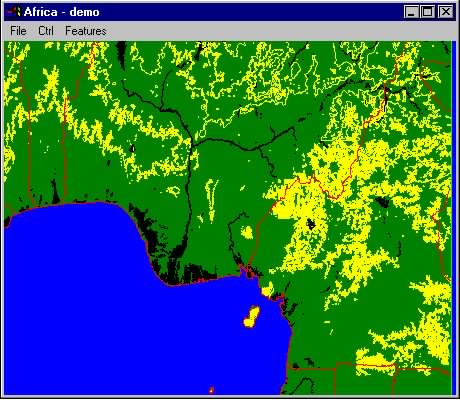


## 5.5 - Conclusions

As this chapter shows, some applications were developed to exercise the
functionality of the DCW Graphics Toolkit and Extabula Toolkit on an
MS Windows platform. These demostration programs are not meant to be
exhaustive since there are many other features available from either
toolkit. A client application could use the DCW Graphics Toolkit for
some functionality and then use the Extabula Toolkit directly for many
other functions. Actually, there are an innumerable number of mapping
functions that could be implemented by a client by using the
Extabula Toolkit directly. 


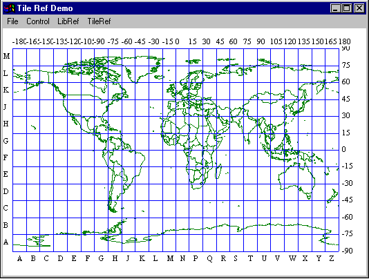
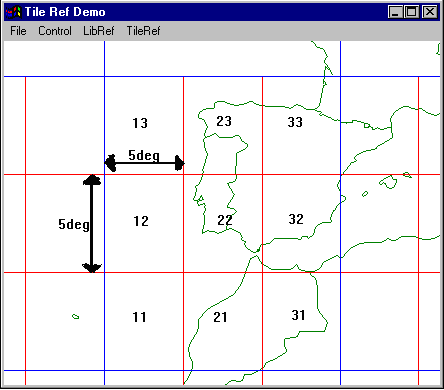
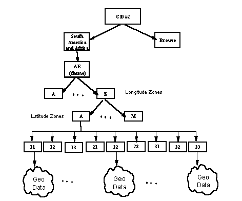
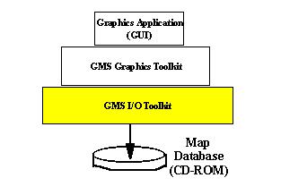
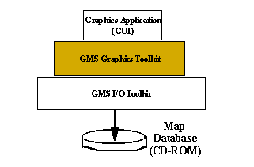
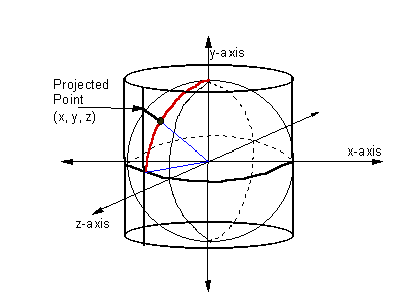
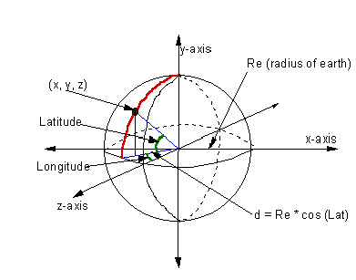
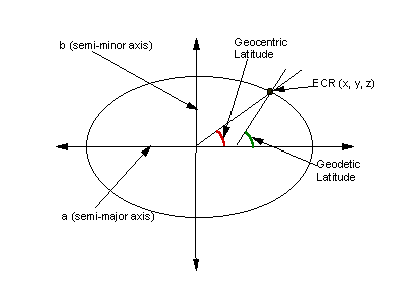
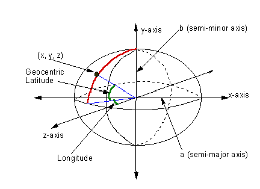
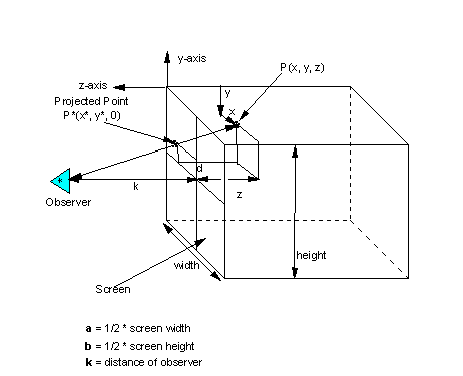
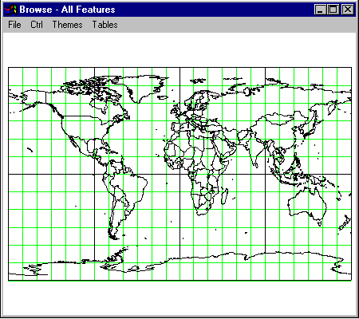
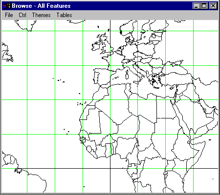
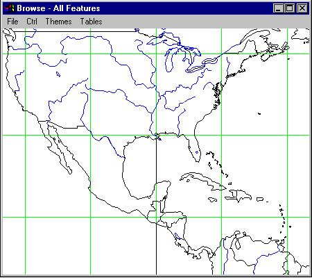
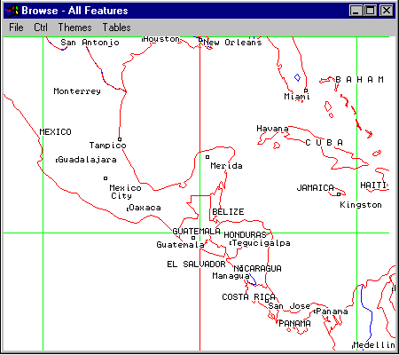
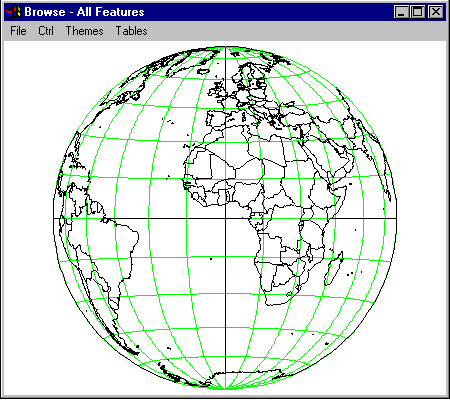
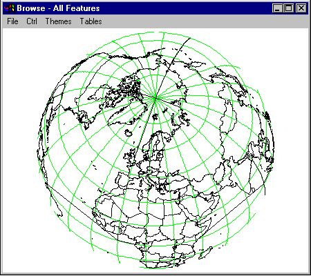
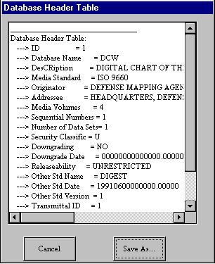
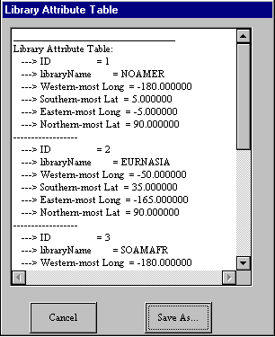
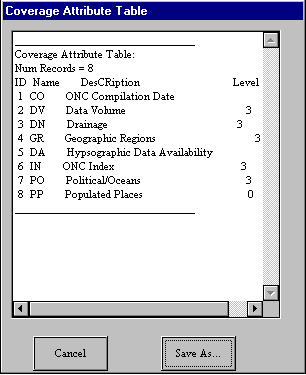
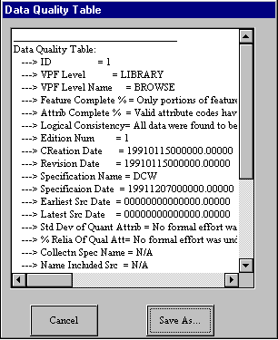
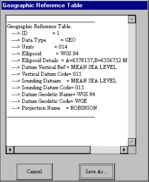
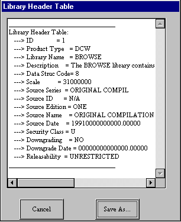
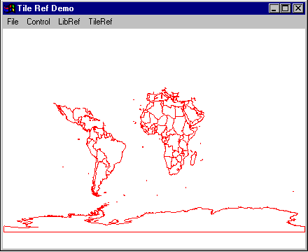
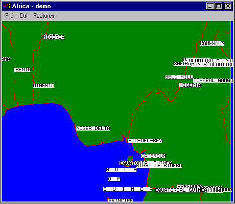
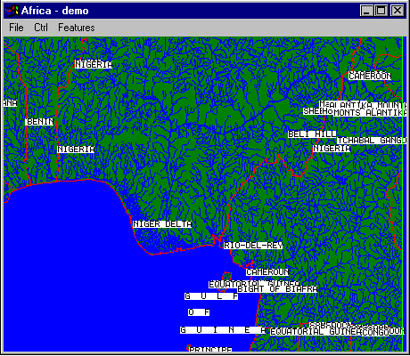
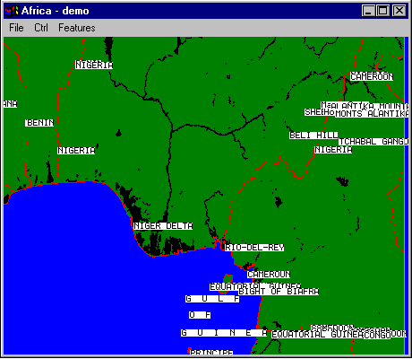
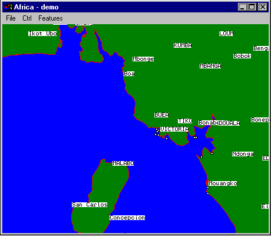
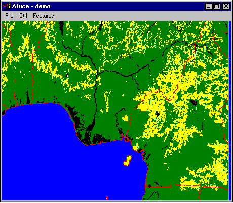
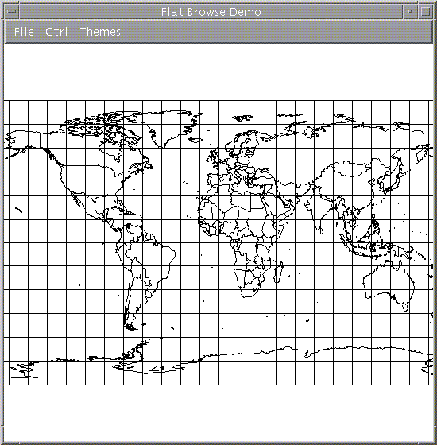
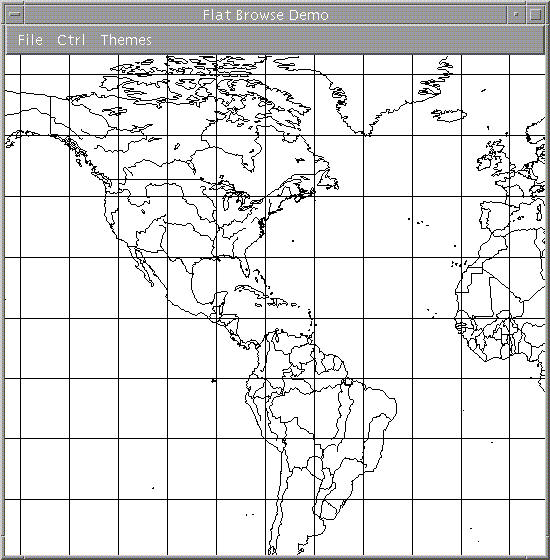
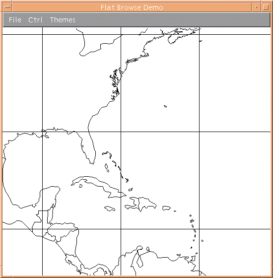
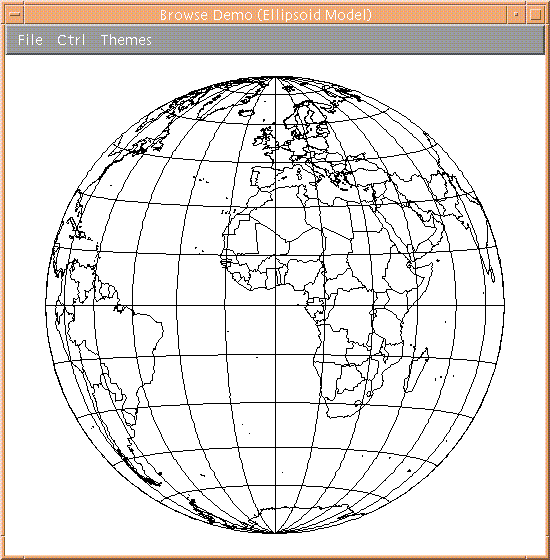
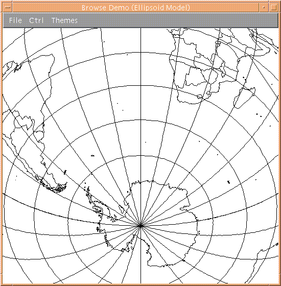
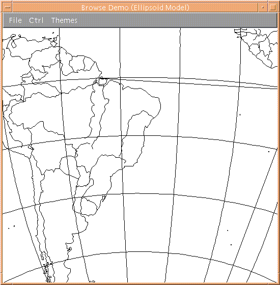

